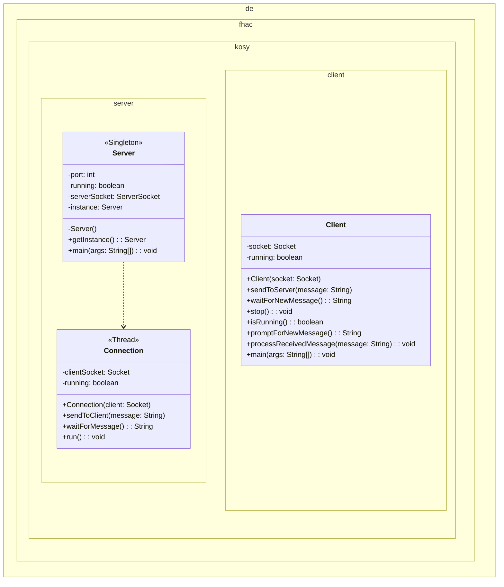

# Multi-Client

## Klassendiagramm

---

## Aufgabenbeschreibung & Hinweise

### `Server` (Main-Klasse im Serverprojekt)
Verwaltungsklasse für verbindungsübergeordnete Daten und Erzeugung neuer `Connection` (Warten auf Verbindungen):
* Warten auf eingehende Verbindungen
* **Erstellen eines neuen Verbindungsobjekts (`Connection`)**
* Verwalten der aktiven Verbindungen (Sie müssen sich die aktiven Verbindungen merken)
* (Verarbeiten der Konfiguration)
* Singleton

---

Nun ist der Server so zu programmieren, dass er multi-client-fähig ist. Dazu müssen Sie dafür sorgen, dass alle blockierenden Methoden in einem eigenen Thread laufen (Auslagerung in `Connection`). 

Folgende Funktionen sind blockierend:
* **Das Warten auf Verbindungen:** `ServerSocket.accept()`
* **Das Lesen von Streams:** `DataInputStream.readUTF()`
* **Das Einlesen von Nutzereingaben:** `Scanner.next....()`

Um das Verbinden mehrerer Clients zu ermöglichen, müssen Sie die blockierenden Methoden in einem eigenen Thread aufrufen. Um diese Trennung zu realisieren, empfehlen wir das oben gezeigte erweiterte Klassendesign.

`Connection` repräsentiert dabei eine aktiv laufende Verbindung vom Server zu einem Client. Diese Verbindung wird hier gekapselt, damit der Serverport für die nächste Verbindung frei wird. Bedenken Sie, dass die Methode `accept()` einen Socket zurückgibt, der für die `Connection` benötigt wird.

**Aufgabe:**
Starten Sie den Server und dann **zwei** Clients und testen Sie die Nachrichtenübermittlung.
